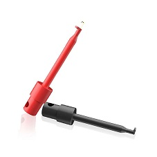

(chap:introduction)=
## Introduction
Electronics play a crucial role in modern laboratories across all sciences — physics, chemistry, biology, and geology — enabling precise measurement of variables like temperature, light, magnetic fields, and more through common transducers. This course is a broad introduction to the electronic tools and techniques widely used today. Rather than making you an expert, this set of experimental activities aims to build your familiarity with practical devices like op amps, data acquisition, and specialized ICs. You'll also gain hands-on experience designing simple circuits and creating computer-controlled data systems. 
```{figure} ../figures/ch1_introduction/electronicsLabAI.png
:label: fig:intro:electronicslab
:width: 60%
:align: center
:alt: Electronics equipment (generated with Google Gemini AI).
```
There is also a portion of this book dedicated to using LabVIEW. LabVIEW is a program designed for electronic interfacing, experiment control, data acquisition, simulation and modeling. It is ubiquitous in science and engineering laboratories, both academic and commercial.

I've intentionally limited the amount of theory in this manual. I want this manual to serve as a modern-day tutorial, similar to the Radio Shack Workbooks of times past. The goal is to help you become more independent and confident in your learning and to make you proficient at the practice of electronics.

The experiments are written to take one or two 3-hour lab periods.

## Safety
Most of the electronics that will be practiced in this manual are no more dangerous than those one may encounter using typical electronic
devices such as cell phones.Many electronics textbooks do not even discuss safety hazards. Probably, the primary hazard in following this manual is mechanical rather than electrical, for example, dropping an instrument or computer on your foot. However, care and safety are always important, and one should avoid exceeding tolerances on all devices. Resistors can get very hot, very fast and can lead to skin burns if touched. Transistors are famous for “popping” when improperly wired. The minor explosion from one could damge the eye. Soldering will not be a significant component of this manual, but solder contains harmful heavy metals and caution should be exercised to protect eyes, hands, and lungs.

It is important not to take electronics lightly. In many lab settings, you'll encounter high voltages that can be dangerous — a current of just a few milliamperes through the heart can be life-threatening. When working with high voltage, it's wise to ground your arm to prevent current from passing through your body if contact is made.

Even when high voltage is not involved, using grounding straps is a good habit—not for your safety, but to protect sensitive electronic components from static discharge, which can easily damage semiconductors. While we don't have enough grounding straps for everyone, most components used in this course are inexpensive. However, if you're working with more advanced components, be sure to ask about borrowing a grounding strap.

## Measurement Instruments

### Multimeters
We will use handheld and benchtop instruments. We will use handheld digital multimeters (DMM) in this course. most likely the ExTech MN36 seen in [](#fig:intro:dmm). 
```{figure} ../figures/ch1_introduction/ExtechMN36.jpg
:label: fig:intro:dmm
:width: 40%
:align: center
:alt: ExTech MN36 digital multimeter.
ExTech MN36 digital multimeter.
```
### Power Supplies
We will use the Elenco XP800 AC/DC power supplies shown in [](#fig:intro:power). We may periodically use other sources of power. However, these Elenco supplies have proven to be stable, workhorse (we are in Kentucky)sources of DC power. 
```{figure} ../figures/ch1_introduction/ElencoPS.jpg
:label: fig:intro:power
:width: 80%
:align: center
:alt: Elenco XP800 AC/DC variable power supply.
Elenco XP800 AC/DC variable power supply.
```
### Function Generators
We will use FeelTech FS3200 signal generators shown in [](#fig:intro:siggen) to produce the AC signals that we will use in this course. They have dual outputs that can be independently controlled, and can produce sinusoidal, square, triangle, and many other signals with frequencies up to 25 MHz. It can be programmed to produce a certain signal without turning the signal on. It has the capability of producing user-defined waveforms also.
```{figure} ../figures/ch3_oscopes/FeelTech.jpg
:label: fig:intro:siggen
:width: 80%
:align: center
:alt: The FeelTech FS3200 signal generator.
The FeelTech FS3200 signal generator.
```
### Oscilloscope
The most widely used instrument in the lab is probably the oscilloscope. In this lab, we will be using the Tektronix Model Tektronix 1102BEDU. This is a fairly advanced analog oscilloscope with a number of useful features, including a built in period/frequency readout, cursoring capability, FFT, and file saving. While the exact operation of oscilloscopes varies widely, the most important elements of
the front end are basically unchanged. Basic operation is discussed in class.
The Tektronix 1102BEDU oscilloscope is shown in [](#fig:intro:oscope).
```{figure} ../figures/ch3_oscopes/Tektronix.jpg
:label: fig:intro:oscope
:width: 80%
:align: center
:alt: The Tektronix 1102BEDU oscilloscope.
The Tektronix 1102BEDU oscilloscope.
```

### Breadboards
A very convenient way to design and troubleshoot a new circuit is to first design it on a breadboard. Breadboards can be of the stand-alone variety, have built in power supplies, or may be bundled with additional stuff for easy access. All are handy because circuits can be wired up without the use of soldering irons, or wire wrapping tools. Be careful not to use wires that are too
thick for the board. Forcing oversized wire into the board may permanently bend the spring contacts: leading to poor connections, no connections, or even possible short circuits to other rows. We will discuss how to use the board in class.
```{figure} ../figures/ch1_introduction/Breadboard-Sizes.png
:label: fig:intro:oscope
:width: 100%
:align: center
:alt: Various breadboard sizes.
Various breadboard sizes.
```

### Electronics connectors
We will use a variety of connections when building circuits and interfacing them with test and measurement equipment. In [](#fig:intro:connections) are shown [(a) banana](#bananaconnector), [(b) alligator](#alligatorconnector), [(c) test clip](#testclipconnector), [(d) test probe](#testprobeconnector) and [(e) BNC](#bncconnector) connectors.
:::{figure}
:label: fig:intro:connections
:align: center

(bananaconnector)=

(alligatorconnector)=

(testclipconnector)=

(testprobeconnector)=

(bncconnector)=


Various electrical connectors - (a) banana, (b) alligator, (c) test clip, (d) test probe, and (e) BNC.
:::
## Circuit Elements and Cables
Throughout this book, you will encounter circuit schematic elements drawn using circuit diagram symbols. Many of these symbols are shown in [](#fig:intro:symbols). There will be reminders throughout the book what the symbols represent as they are introduced in experiments.
```{figure} ../figures/ch1_introduction/Electrical-Schematic-Symbols.png
:label: fig:intro:symbols
:width: 100%
:align: center
:alt: Electrical schematic symbols.
Electrical schematic symbols.
```