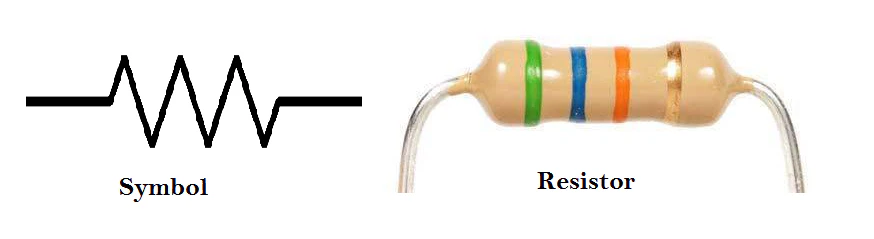

(chap:resistors)=
# Overview
:::{hint} Learning Objectives
* Understand DC circuits and Ohm's Law.
* Understand the role of resistance in circuits.
* Understand methods of measuring current and voltage.
* Demonstrate the ability to draw, construct, and analyze resistor circuits.
:::

# Introduction

All of the experiments will have a virtual component to accompany the work on the lab bench. The virtual experiments are done using the PhET simulator below. Click on the "Lab" tab. 

:::{iframe} https://phet.colorado.edu/sims/html/circuit-construction-kit-dc/latest/circuit-construction-kit-dc_all.html
:label: chap:resistors:PhET
:width: 100%
:align: center
:placeholder: ../figures/ch2_resistors/PhETscreenshot.png
A PhET simulation to explore simple circuits.
:::

# Background
Ohm’s Law says 
```{math}
:label: eq:resistors:ohms
V = IR
```
or voltage equals the current times the resistance. $V$ is in Volts (Volts are Joules/Coulomb). $I$ is in amperes (or Coulomb per second), and $R$ is in Ohms (units you could work out from the others). These are SI units. Voltage, also called electric potential, is the source of energy pushing electrons through a typical circuit. Flowing charges, or current, is a result of the voltage pushing charges against electrical resistance. As voltage increases, the current should increase linearly for a particular resistance.
```{exercise}
:label: exercise:resistors:deliverable1
Explain how an increase in the current (number of charges flowing per second, not the speed of the charges) is a response to increasing voltage described by conservation of energy.
```

## Circuit Loop Rules
The word circuit comes from the idea that electronics make loops. A circuit or electronic loop must conserve energy. This leads to two circuit rules.
1.	The sum of voltages around a loop are zero, e.g., energy in from a battery equals energy out dissipated by a resistor.
2.	The current through a circuit or electronic loop is constant.
In [](#fig:resistors:singleR), on the left is a circuit shown as we might see in the lab with a battery and a resistor. On the right is the equivalent circuit diagram. We assume wires are ideal, with zero resistance.
```{figure} ../figures/ch2_resistors/singleR.png
:label: fig:resistors:singleR
:width: 80%
:align: center
:alt: Circuit showing a single resistor connected to a battery or power source. On the left is the PhET cartoon with a battery and 10 Ohm resistor. On the right is the circuit diagram.
Circuit showing a single resistor connected to a battery or power source. On the left is the PhET cartoon with a battery and 10 Ohm resistor. On the right is the circuit diagram.
```

```{exercise}
* In your lab notebook, make a note of what battery and resistor circuit diagrams look like. 
* Which side of the battery is +, and which side is -? 
* How is this polarity indicated in the circuit diagram on the right?
```
## Identifying Resistors

The resistors we will use have four or five colored bands on them. These bands quantify the resistance as shown in [](#fig:resistors:resistorBands).
```{figure} ../figures/ch2_resistors/resistorBands.jpg
:label: fig:resistors:resistorBands
:width: 100%
:align: center
:alt: Circuit showing a single resistor connected to a battery or power source. On the right is the PhET cartoon with a battery and 10 Ohm resistor. On the left is the circuit diagram.
Circuit showing a single resistor connected to a battery or power source. On the right is the PhET cartoon with a battery and 10 Ohm resistor. On the left is the circuit diagram.
```
For example, a resistor with yellow, violet, red, and silver bands gives the numbers $4, 7, 2, \pm 10 \%$. This indicates the resistance is $47 \times 10^2=4700 \pm10 \%=4700 \pm470\Omega$.
 ```{exercise}

* Calculate the resistance of the resistor shown in [](#fig:resistors:exampleBands) with green, blue, orange, and gold bands.
* Suppose this resistor is connected to a 3 Volt battery like the image of a circuit above. Using Ohm's Law in equation {eq}`eq:resistors:ohms`, what current will flow through the circuit?
```

## Measuring Voltage and Current

### 🔌 Voltage is Measured in Parallel

#### Why in parallel?
Voltage is the **potential difference between two points**. To measure that, you need to compare the electric potential at one point **relative to another**.

#### How?
- Place the **multimeter probes across** (in parallel with) the component.
- This allows the meter to measure the drop in electric potential **through** that component.

#### Example:
To measure the voltage across a resistor, you touch:
- One probe to the resistor's current input side.
- The other to the current output side.
- See [](#fig:resistors:elecmeasure)

💡 Think of it like checking the **pressure difference across a valve** in a water pipe.

---

### ⚡ Current is Measured in Series

#### Why in series?
Current is the **flow of electric charge** through a circuit. To measure it, the current must pass **through the multimeter** so it can count how much is flowing.

#### How?
- Break the circuit and insert the multimeter **in line** with the component (in series).
- This forces all the current flowing through that component to also go through the meter.

#### Example:
To measure the current through an LED, you'd:
- Disconnect one side of the LED.
- Connect the multimeter between the disconnected lead and where it was attached.

💡 This is like measuring **water flow by putting a meter in the pipe**—the water (or electrons) must pass through it.

---
```{figure} ../figures/ch2_resistors/volt_current_measure.jpg
:width: 80%
:align: center
:alt: A visual for how to measure voltage and current.
A visual for how to measure voltage and current.
```

### Quick Summary:

| Measurement | Connection Type | Why? |
|-------------|------------------|------|
| **Voltage** | Parallel          | Measures potential *difference* between two points |
| **Current** | Series            | Measures *flow* of charge through a path         |


# Experiment

## Part 1 – Single Resistor

Set up the circuit shown above with a single resistor in the simulator and on the lab bench. From the colored bands, determine the resistance and set the same resistance in the simulator. On the lab bench, you will use a power supply instead of a battery so that you can adjust the voltage. Apply the voltages as shown in the [](#tab:resistors:singleR) and measure the current flows for each applied voltage.
```{table}
:label: tab:resistors:singleR
| Voltage (V) | Current (A) |
|:-----------:|:-----------:|
|      0.5    |             |
|      1.0    |             |
|      1.5    |             |
|      2.0    |             |
|      2.5    |             |
|      3.0    |             |
```{exercise}
:label: exercise:resistor:singleR
* Plot V vs I. What is the slope of your graph including uncertainty (We will go over graphing and fitting in Python.)? 
* How does your slope compare to the theoretical value of the resistor from its bands including uncertainty? Does the simulation give the same results as your experiment? Explain.
```

## Part 2 – Series Resistors
Set up a "series" circuit with two resistors in series as shown below. From the colored bands, determine the resistances and set those same resistances and voltages in the simulator.  Apply the voltages as shown in the table and measure the currents at the locations indicated (1-4) in the simulation. Measure the current anywhere on the real circuit. Measure the voltage across each resistor (two voltage measurements).
```{figure} ../figures/ch2_resistors/seriesR.svg
:label: fig:resistors:seriesR
:width: 50%
:align: center
:alt: Circuit showing a two resistors in series connected to a battery or power source.
Circuit showing a two resistors in series connected to a battery or power source.
```

## Part 3 - Parallel Resistors

```{figure} ../figures/ch2_resistors/parallelR.svg
:label: fig:resistors:parallelR
:width: 50%
:align: center
:alt: Circuit showing a two resistors in parallel connected to a battery or power source.
Circuit showing a two resistors in parallel connected to a battery or power source.
```

## Part 3 - Application: Voltage Divider to Measure Temperature

### Voltage Divider Overview

A voltage divider has two essential parts: the circuit and the equation.

### The Circuit
A voltage divider is created by connecting two resistors in series across a voltage source. You might see this circuit drawn in slightly different ways, but the basic setup is always the same.
```{figure} ../figures/ch2_resistors/VDivider.svg
:label: fig:resistors:parallelR
:width: 50%
:align: center
:alt: A voltage divider circuit with an unknown resistor $R_T$.
A voltage divider circuit with an unknown resistor $R_T$.
```
We will label the resistor connected closest to the input voltage ($V_o$) as $R_T$, and the resistor connected closer to ground as $R_1$, where we know the input voltage and the resistance of $R_1$. $R_T$ is a variable resistance that changes with temperature. The voltage measured across $R_1$ is called $V_1$.

That's really all there is!
$V_1$ is the "divided" voltage — a specific fraction of the input voltage.

### The Equation
To use a voltage divider, you need to know three values. In this case, we know the input voltage ($V_o$), the resistor values $R_1$, and we measure the voltage across the known resistor $R_1$. With these, you can calculate the unknown resistance ($R_T$) using resistor circuit formulas.

Voltages sum:
```{math}
:label: eq:resistors:sumV
V_o = V_1 + V_T
```
Ohm's Law of equation {eq}`eq:resistors:ohms` for a series circuit is a constant current flowing through both resistors. We are free to substitute any $V$ with $IR$, where $I=V_o/R$ and $R=R_1+R_T$. Together, we can write
```{math}
:label: eq:resistors:vdivider
R_T = \left(\frac{V_o}{V_1}-1\right)R_1
```
The last equation in {eq}`eq:resistors:vdivider` shows that the unknown resistance can be calculated by measuring the voltage of the known resistor.
