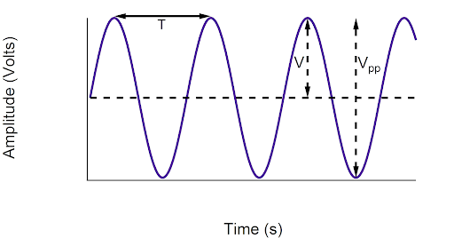
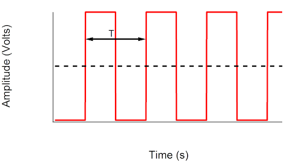
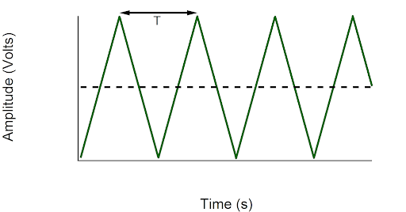

(chap:rc)=
# Overview
:::{hint} Learning Objectives
* Students will demonstrate proficiency in the observation, analysis, and interpretation of experimental data, including the role that uncertainty plays in interpreting experimental results.
* Students operate signal generators and oscilloscopes to set up experiments in with resistors and capacitors
* Students analyze data related to RC circuits.
* Students articulate results of these experiments including experimental uncertainty.
:::

# Introduction

We will continue using a FeelTech FY3200S signal generator and a Tektronix TBS 1072B-EDU digital oscilloscope to measure the waveforms connected to series resistor and capacitor circuits.

Part 1 of this lab is to measure and compare peak-to-peak and rms voltages. The peak-to-peak voltage is the actual amplitude of an alternating signal between the highest peak to the lowest peak. Diagrams of three waveforms (sine, square, and triangle) are shown in [](#fig:rc:waves). The period and peak-to-peak voltage are labeled.
:::{figure}
:label: fig:rc:waves
:align: center

(sine)=
)
(square)=

(triangle)=


A sine wave, square wave, and triangle wave form. The rms voltages are $V_{rms}=V/\sqrt{2}=V_{pp}/2\sqrt{2}$ for the sine waveform, $V_{rms}=V=V_{pp}/2$ for the square waveform, and $V_{rms}=V/\sqrt{3}=V_{pp}/2\sqrt{3}$ for the triangle waveform.
:::

Part 2 of this lab is to measure the response or output of series resistor and capacitor (RC) circuits when given DC or AC input.

# Procedure
## Part 1 Theory of RMS Voltage
Periodic voltages without DC voltage contribution such as sine-, square- or triangular- wave voltages, see Fig. 2, are characterized by the period T, frequency f = 1/T, amplitude V, peak-to-peak value Vpp = 2V, and rms value Vrms. The rms value corresponds to the value of a DC voltage which – at a given electrical resistance – leads to the same dissipated power as the AC voltage. The rms voltage can be calculated by averaging the square of the AC voltage, V(t):
```{math}
:label: eq:rc:rms
V_{rms} = \sqrt{\langle V^2\rangle}=\sqrt{\frac{1}{T}\int_0^T \left(V(t)\right)^2 dt}
```
where $\langle V^2\rangle$ is the average of the voltage squared. Evaluation of this integral leads to different effective values for the voltage-time characteristics as shown in [](#fig:rc:waves).

## Part 1 Measurements
Create each of these signals as with the signal generator such that they are $V_{pp}=5$ Volts for a frequency of $f=1000$ Hz. Connect a BNC to alligator clips cable to the signal generator. Measure the rms voltage using a multimeter set to AC Volts. Connect a BNC to BNC cable so that you can measure the signal on the oscilloscope. Adjust your oscilloscope such that you see approximately 2 periods of the wave. Repeat these activities for 100 Hz. You should include estimated uncertainties.
```{exercise}
Create a table like [](#tab:rc:rmsV) and comment on any apparent discrepancies (out of uncertainty range for example) or frequency dependence.
```
```{table} Comparison of peak-to-peak and rms voltages at 1 kHz and 100 Hz.
:label: tab:rc:rmsV
:align: center
| Signal Wave | RMS Voltage | Peak-to-peak Voltage |
|:------------|:------------|:---------------------|
|     Sine    |             |                      |
|    Square   |             |                      |
|   Triangle  |             |                      |
```

## Part 2a Theory of RC Circuits
A series circuit consists of a resistance, R, and a capacitor, C. Draw the circuit in your lab notebook including the AC input square wave. At t = 0 seconds a square voltage is applied to this circuit, such that a current I(t) flows. This current charges the capacitor. The voltage across the capacitor VC(t) is measured over time and shows an increasing voltage with time from a value of zero approaching the applied voltage, Vo, of the square wave. According to Kirchhoff’s loop rules, the sum of the voltages across the capacitor and resistor must add to the applied voltage. The voltage on the capacitor has the form VC=Q/C, and the resistor voltage is VR=IR. Summing them gives

Vo=VC+VR=QC+IR

The current is the amount of charge flowing through the circuit per unit time, I=dQ/dt. Replace the current in the above equation to obtain a differential equation of Q. This leads to a linear, non-homogeneous differential equation of first order:

Vo=QC+dQdtR

Solve this to obtain the time-dependent charging on the capacitor that can be converted to voltage on the capacitor

VC(t)=Vo(1-e-t/RC).

Follow similar logic for discharging when the square wave goes to zero (Vo = 0) to obtain

VC(t)=Voe-t/RC=Voe-t/RC.

This result implies that there is a characteristic time for charging and discharging. This characteristic time is defined as the time when t = τRC = RC. (Show that RC has units of time.) This simplifies the equation for capacitor voltage to
VC(t)=Voe-1=Voe.

In principle the capacitor needs infinitely long to charge or discharge, since the exponential function reaches zero only for infinitely long time spans. In the measurement, however, one obtains sufficiently good accuracy, when choosing the period of the square wave voltage such that it is large compared to the relaxation time. If this condition is not fulfilled, the charging starts with a voltage Vmin > 0 and reaches only a voltage Vmax < Vo , i.e. the image on the oscilloscope shows only a section of the voltage-time curve.
Part 2a - Measurements

Let’s set up the circuit and oscilloscope to observe this. Once you have seen the effect, change the frequency of your input square wave so that the period is longer (~5-10 times) than the RC time constant. You can estimate this by calculating RC in your lab notebook. The capacitor you have is 0.1 μF. We will start with R=10 kΩ. Then, adjust the frequency such that (T = 1/f ~ 10 RC). What frequency is this? You should be able to adjust the oscilloscope to look like Figure 3. What X and Y settings are you using on your oscilloscope? Do these make sense?


Figure 3. A square wave input (red) and output (blue) measured across a capacitor in an RC circuit.

In order to get an accurate value of τRC, we should zoom in on the charging and discharging as shown in Fig. 4.


Figure 4. A close-up image of the charging and discharging capacitor circuit with a series resistor.


Deliverable 3: Explain your process for finding τRC and its value with uncertainty.
Part 2b - Theory of AC Impedances
A single capacitor circuit with a sinusoidal input voltage will have a time-dependent voltage across the capacitor that is ideally
VC=Vocos(t)
The current can be calculated by using the capacitor charge Q =VC and I=dQ/dt to obtain

IC=CVosin(t)=CVocos(t+/2),

indicating a phase shift θ = π/2 rad between the voltage and current on the capacitor. The maximum current is Imax=ωCVo. Similar to Ohm’s Law, there is a capacitive reactance, XC, for the maximum current and voltage

XC=VoImax=1C.


Capacitive reactance is a resistance to voltage changes rather than current changes as in a resistor. Because it is a type of resistance, it can be added to resistor resistance as a total impedance,Z, of an RC circuit. The equation above is only a relationship for the maximum values of voltage and current due to the phase difference between the time-dependent values. Using the idea that the two impedance values are 90o out of phase are like orthogonal vectors (phasors), we can compute the total impedance using something like the Pythagorean Theorem.


Figure 4. A diagram of impedance phasors.

The voltage is a sum of the voltages on the resistor and capacitor. In a simple resistor circuit the voltage and current would follow one another as Vocos t. As noted above the voltage and current for a capacitor are 90o out of phase. 


Where the imaginary i indicates an independent vector (phasor) direction that is due to the frequency dependence of the capacitor impedance. For a series circuit, we can describe the total impedance by

Z2total= XR2 + XC2

The magnitude of each impedance determines the phase angle between input voltage and the voltage across the resistor in the circuit. The current in the circuit can be measured by the voltage drop in the resistor because there is no phase added by the resistor. Using Fig. 4 one can find a relationship between the impedances


From this, we can define a crossover frequency when ω = 1/RC, θ = 45o. This is where the resistor voltage equals the capacitor voltage (see Fig. 6). The phase will be between 0 and 90o depending on ω, R, and C, and you will see something like Fig. 5 on your oscilloscope.


Figure 5. A plot showing the phase shift in a series RC circuit. The phase shift is  t.

We can make substitutions to derive the maximum current in the circuit

and the maximum voltage on the resistor

and capacitor


Part 2b - Measurements
Use the oscilloscope to verify these relationships by setting Vo=5 V and measuring VR and VC at 100 Hz and 500 Hz using C = 0.1 μF and R = 10 kᘯ. Draw waveforms in your lab notebook. Next, use your oscilloscope to measure VR and VC as a function of ω. Plot on the same graph VR vs. ω and VC  vs. ω. They should look like the graph below. Plot the functions above on top of your data and comment on the accuracy of the theoretical model.


Figure 6. The voltages across a resistor (blue) and capacitor (orange) in a series circuit as a function of input sinusoidal frequency, ω.

Because the resistor voltage increases with frequency, it can be used as a high-pass filter, passing only voltages of high frequency. Contrary to the resistor, the capacitor passes only low frequency voltages. It can therefore be used as a low-pass filter.

Deliverable 4: Show the mathematical work to obtain the resistor and capacitor voltage equations above.
Deliverable 5: Make the measurements to make a graph like Figure 6. Use Colab and qexpy to produce all graphs in this lab.
Challenge #1
Create a circuit that might turn on a lamp to mimic the sunrise. It should slowly charge a capacitor over approximately 30 minutes. Explain how you designed, built, and tested this circuit.
Challenge #2
Create a circuit that could be used for tone adjustment on a guitar. Using variable resistors and regular capacitors, make a high pass and a low pass filter for a single AC input.

